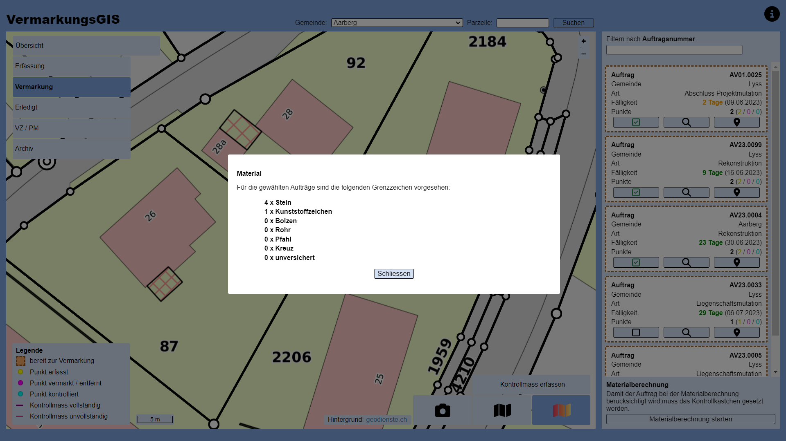

# VermarkungsGIS

Verwaltungstool (WebGIS) für die Vermarkung der Grenzzeichen in der amtlichen Vermessung, eingeschlossen zurückgestellte Vermarkungen und Projektmutationen. Entwickelt innerhalb der Bachelorthesis (12/2023) mit dem Titel "Weniger Staub, mehr Daten - neue Prozesse in der amtlichen Vermessung" am [Institut Geomatik](https://www.fhnw.ch/de/die-fhnw/hochschulen/architektur-bau-geomatik/institute/institut-geomatik) der Hochschule für Architektur, Bau und Geomatik.

Stand: 06.06.2023

  
## Aufbau

Das WebGIS teilt sich in verschieden Modi, welche ihrerseits über zugeschnittene Darstellungen und Funktionen verfügen. Folgende sechs Modi wurden realisiert:
*   [Übersicht](#übersicht) &rarr; allgemeiner Überblick
*   [Erfassung](#erfassung) &rarr; Auftragserfassung (Büro)
*   [Vermarkung](#vermarkung) &rarr; definitive Kennzeichnung der Grenzzeichen im Feld 
*   [Erledigt](#erledigt) &rarr; Auftragskontrolle (Büro)
*   [VZ / PM](#vz--pm) &rarr; Verwaltung von zurückgestellten Vermarkungen und Projektmutationen
*   [Archiv](#archiv) &rarr; abgeschlossene Aufträge

Hintergrundauswahl, Parzellensuche, Legende (jeweils angepasst), Massstabsbalken, Quellenangabe und Hilfestellung sind in allen Modi verfügbar. Die weiteren Funktionen der Modi werden in den folgenden Abschnitten erläutert.

  
   
  <em>Abb. 1: Allgemeinde Steuerelemente des WebGIS.</em>

>>#### Legende Abbildung:
>>1. Moduswahl (angepasst an Modus)
>>2. Legende (angepasst an Modus)
>>3. Massstabsbalken
>>4. Quellenangabe Hintergrund
>>5. Hintergrundauswahlt (angepasst an Zoomstufe)
>>6. Hilfestellung
>>7. Parzellensuche
>>8. Zoom

  
## Modi

  
### Übersicht
---
Dieser Modus dient der Übersicht über die Aufträge, dabei können die Aufträge nach ihrem Status ein- und ausgeblendet werden. Zusätzlich steht eine Auftragssuche zur Verfügung. Beim Klick auf den ***Suchen***-Button werden alle Aufträge gesucht, welche mit der eingegebenen Zeichenfolge beginnen. Die gefundenen Aufträge werden anschliessend nach der Auftragsnummer aufsteigen aufgelistet, über das ***Lupen***-Symbol kann auf den entsprechenden Auftrag gezommt werden.

  
   
  <em>Abb. 2: Funktionen des WebGIS im Modus Übersicht.</em>

>>#### Legende Abbildung:
>>1. Layer ein- und ausblenden
>>2. Zoom auf Auftrag
>>3. Auftragssuche

Beim Anklicken eines Objektes öffnet sich eine Popup, welches alle Informationen über das Objekt anzeigt. Mit einem Klick auf das ***Zahnrad***-Symbol können die Werte verändert werden. Ein Speichern der Änderungen über den ***Speichern***-Button ist zwingend notwendig, ansonsten gehen die Änderungen verloren.

  
   
  <em>Abb. 3: Funktionen (Auftrags-) Popup im Modus Übersicht.</em>

>>#### Legende Abbildung:
>>1. Objektinformationen bearbeiten
>>2. Popup schliessen 

  
### Erfassung
---
Innerhalb von diesem Modus können Aufträge und die dazugehörigen Punkte erfasst werden. Zusätzlich werden alle Aufträge mit dem Status *erfasst* dem Erfassungsdatum nach absteigend aufgelistet. Die Auflistung kann mit entsprechender Eingabe gefiltert werden. Punkte können nur innerhalb von bestehenden Auftragsflächen erfasst werden.

  
   
  <em>Abb. 4: Funktionen des WebGIS im Modus Erfassung.</em>

>>#### Legende Abbildung:
>>1. Auftrag erfassen
>>2. Vermarkungspunkt erfassen
>>3. Aufträge filtern

Beim Erfassen der Geometrien kann sowohl auf Grenzpunkten, wie auch auf Fixpunkten gefangen werden. Nach der Erstellung des Objekts öffnet sich automatisch ein Popup, in welchem alle nötigen Attributwerte vergeben werden können. Dabei wird die Gemeinde automatisch mit einem Abgleich mit den Gemeindegrenzen ermittelt, eine Anpassung ist möglich. Durch denn Klick auf den ***Speichern***-Button wir eine WFS-Transaktion ausgelöst und das Objekt in der Datenbank gespeichert.

Während dem Erfassen eines Objekts besteht über die Funktionsbutton zur Erstellung die Möglichkeit die Erfassung abzubrechen. Auch durch wechseln des Modus kann die Erfassung abgebrochen werden.

  
   
  <em>Abb. 5: Funktionen (Auftrags-) Erfassungspopup im Modus Erfassung.</em>

>>#### Legende Abbildung:
>>1. Erfasstes Objekt speichern
>>2. Popup schliessen (Abbruch der Erfassung - Objekt wird nicht gespeichert)

Nach der Erfassung des Auftrags und der dazugehörigen Punkte (und entsprechenden Vorarbeiten im Feld) kann der Auftrag zur Vermarkung freigegeben werden. Dazu kann der Auftrag angeklickt werden und im sich öffnenden Popup mit dem ***Freigeben***-Button (erscheint erst, wenn Auftrag in Datenbank gespeichert) freigegeben werden. 

Sobald ein Objekt (Auftrag oder Punkt) in der Datenbank gespeichert ist, besteht zudem die Möglichkeit seine Geometrie zu bearbeiten. Die Bearbeitung kann mit dem ***Stift***-Symbol im Popup geöffnet werden. Es können jeweils nur die Elemente des entsprechenden Auftrags bearbeitet werden. Nach der Bearbeitung müssen zwingend alle Vermarkungspunkte innerhalb der Auftragsfläche liegen.

  
   
  <em>Abb. 6: Funktionen (Auftrags-) Popup im Modus Erfassung.</em>

>>#### Legende Abbildung:
>>1. Auftrag für Steinsatz freigeben
>>2. Geometrie bearbeiten
>>3. Objektinformationen bearbeiten

Die leicht veränderte Oberfläche während der Geometriebearbeitung bietet eine minimale Anleitung, sowie einen Button zum Speichern der getätigten Änderungen. Die Stützpunkte (oder Punkte) können mit gedrücktgehaltener Maustaste (links) verschoben werden, die ***Umschalt***-Taste ermöglicht mit gleichzeitigem Linksklick das Löschen von Stützpunkten. Auch bei der Modifizierung von Geometrien kann auf den Grenzpunkten und Fixpunkten gefangen werden.

  
   
  <em>Abb. 7: (Auftrags-) Geometrie bearbeiten im Modus Erfassung.</em>

>>#### Legende Abbildung:
>>1. Geometriebearbeitung beenden (automatische Speicherung)
>>2. Kurzanleitung

  
### Vermarkung
---
Dieser Modus dient dem Feldpersonal. Wie bereits im vorangegangenen Modus werden alle relevanten Aufträge (Status = *bereit für Vermarkung*) aufgelistet. Die Auflistung ist nach der Fälligkeit sortiert. Nebst dem Zoom auf den Auftrag beinhaltet ein Auftrag neu auch die Möglichkeit, ihn in die Materialberechnung einzubeziehen oder seinen Standort auf Google Maps zu öffnen. Die Materialberechnung dient dem Beladen des Feldfahrzeuges und berücksichtigt alle aktivierten Aufträge (unter Berücksichtigung der bereits gesetzten Zeichen). Ist die Vermarkung eines Punktes erstellt kann das definitive Vermarkungszeichen gesetzt werden, zusätzlich lässt sich eine Kontrolle erfassen. Erst wenn alle Punkte vermarkt sind, kann auch der Auftrag mit dem ***Vermarkung abschliessen***-Button abgeschlossen werden.  

  
   
  <em>Abb. 8: Funktionen des WebGIS im Modus Vermarkung.</em>

>>#### Legende Abbildung:
>>1. Objektinformationen bearbeiten
>>2. Vermarkung abschliessen
>>3. Kontrollmass erfassen
>>4. Auftrag zur Materialberechnung hinzufügen / Entfernen
>>5. Standort in Google Maps öffnen
>>6. Zoom auf Auftrag
>>7. Materialberechnung ausführen

  
   
  <em>Abb. 9: Materialberechnung im Modus Vermarkung.</em>

Kontollmasse können über den Funktionsbutton ***Kontrollmass erfassen*** direkt digital erstellt werden. Dabei gilt zu beachten, dass das Kontrollmass zwingend auf einem Vermarkungspunkt starten muss. Nach dem Absetzen der beiden Punke öffnet sich ein Popup. Die Soll-Distanz berechnet sich direkt aus den Koordinaten, sollte aber aufgrund der eingeschränkten Fangmöglichkeiten noch überprüft werden. 

  
   
  <em>Abb. 10: Funktionen Kontrollmass-Erfassungspopup im Modus Erfassung.</em>

>>#### Legende Abbildung:
>>1. Erfasstes Kontrollmass speichern

  
### Erledigt
---
Dieser Modus dient der Kontrolle der vermarkten Aufträge. Einerseits können bereits erstellte Kontrollen überprüft und vervollständigt werden, andererseits lassen sich Kontrollen organisieren. Sobald allen Punkte über eine vollständige Kontrolle verfügen, kann der Auftrag über den ***Auftrag archivieren***-Button archiviert werden. Auch in diesem Modus kann über die nach der Auftragsnummer sortierte Auflistung der Aufträge auf den Auftrag gezoomt werden. Unvollständige Kontrollmasse lassen sich vervollständigen, zwingend für Auftragsarchivierung. Vor der Archivierung sollte zwingend das definitive Grenzzeichen in der Datenbank der amtlichen Vermessung abgeglichen werden.

  
   
  <em>Abb. 11: Funktionen des WebGIS im Modus Erfassung.</em>

>>#### Legende Abbildung:
>>1. Objektinformationen bearbeiten
>>2. Änderungen speichern
>>3. Aufträge filtern
>>4. Zoom auf Auftrag

  
### VZ / PM
---
Innerhalb von diesem Modus werden zurückgestellten Vermarkungen und Projektmutationen verwaltet. Je nach Interesse ist es möglich Layer ein- und auszublenden. Die Auflistung der Aufträge ist nach der Anzahl Tage seit der Erfassung (Rückstellung) sortiert. Wie bereits in den vorherigen Modi, kann die Auflistung gefiltert werden. Sobald ein Bauprojekt realisiert wurde und die entsprechenden Vorbereitungen auf dem Feld getätigt wurden, kann der Auftrag über den ***Freigeben***-Button für die Vermarkung freigegeben werden.

  
   
  <em>Abb. 12: Funktionen des WebGIS im Modus VZ / PM.</em>

>>#### Legende Abbildung:
>>1. Layer ein- und ausblenden
>>2. Objektinformationen bearbeiten
>>3. Änderungen speichern
>>4. Auftrag zur Vermarkung freigeben
>>5. Aufträge filtern
>>6. Zoom auf Auftrag

  
### Archiv
---
Dieser Modus dient der Archivierung der Aufträge. Ein Löschen aller Aufträge mit einem Vermarkungsdatum älter als ein Jahr ist eingebaut (temporäre Lösung). Zudem ist eine Auftragssuche integriert, für das Auffinden eines Auftrages ist die vollständige Nummer einzugeben. Bei erfolgreicher Suche wird automatisch auf den Auftrag gezoomt.

  
   
  <em>Abb. 13: Funktionen des WebGIS im Modus Archiv.</em>

>>#### Legende Abbildung:
>>1. Objektinformationen bearbeiten
>>2. Auftragssuche
>>3. Aufträge automatisiert löschen

  
---
GitHub Repository: [https://github.com/lucareber/VermarkungsGIS](https://github.com/lucareber/VermarkungsGIS)
